# EEDCaP: End-to-End Discord Dataset Creation Pipeline

  

End-to-end flow from raw Discord data to final Parquet dataset with full statistics. Every stage is idempotent and CLI-driven.

## High-Level Flow

```mermaid
flowchart TD
    A[Discord]:::c1 --> B[DISCORD BOT]:::c2
    B --> C[discord.py]:::c3
    C --> D[nodejs express]:::c4
    D --> E[(Postgres)]:::db

    E --> G["filter.sql (Postgres filter)"]:::sql

    subgraph S[" "]
    direction LR
        G --> H["chains.sh (wrapper script)"]:::c9
        H --> J["chainsrunner<br>(SQL inside sh)"]:::c10
    J --> K["smartclean.py"]:::clean
    J --> L["split.py + smartcleansplit.py + combineall.py"]:::clean
    end
    style S fill:#512da8,stroke:#311b92,color:#ffffff,stroke-width:3px

    %% One dump from each branch
    K --> M1["dump_1.csv"]:::file
    L --> M2["dump_2.csv"]:::file

    %% Both go into combineall.py
    M1 --> N["combineall.py<br>(merge the table dumps)"]:::c15
    M2 --> N
    N --> O["filterturns.py (min 2)"]:::c16
    O --> P["dedupe.py (filters repeated exchanges)"]:::c17
    P --> Q["dropcols.py<br>(drop PII columns)"]:::c18
    Q --> R["tos.py (remove ToS risk)"]:::tos
    R --> S1["fixend.py<br>(normalize end tags)"]:::fix
    S1 --> T["stats.py<br>(adds per-sample statistics)"]:::stats

    %% Stats branches → center par.py
    T --> Y["tokens.py (token.log)"]:::stats
    T --> U["par.py (CSV→Parquet)"]:::pack
    T --> Z["turnstats.py<br>(turn-count histogram)"]:::hist

    U --> V["sortpar.py<br>(sorts Parquet)"]:::pack
    V --> W["cleanpar.py<br>(remove temporary columns)"]:::pack
    W --> X["parjson.py<br>(dataset_infos.json)"]:::meta

    %% STYLE CLASSES (use colons)
    classDef c1 fill:#ffffff,stroke:#000000,color:#000000,stroke-width:2px
    classDef c2 fill:#fff4cc,stroke:#000000,color:#000000,stroke-width:2px
    classDef c3 fill:#ffeb3b,stroke:#fbc02d,color:#000000,stroke-width:2px
    classDef c4 fill:#ff9800,stroke:#e65100,color:#000000,stroke-width:3px
    classDef db fill:#e64a19,stroke:#bf360c,color:#ffffff,stroke-width:3px
    classDef sql fill:#c2185b,stroke:#880e4f,color:#ffffff,stroke-width:3px
    classDef c7 fill:#9c27b0,stroke:#6a1b9a,color:#ffffff,stroke-width:3px
    classDef c9 fill:#5e35b1,stroke:#311b92,color:#ffffff,stroke-width:3px
    classDef c10 fill:#3949ab,stroke:#1a237e,color:#ffffff,stroke-width:3px
    classDef c11 fill:#283593,stroke:#1a237e,color:#ffffff,stroke-width:3px
    classDef clean fill:#00897b,stroke:#004d40,color:#ffffff,stroke-width:3px
    classDef file fill:#90a4ae,stroke:#455a64,color:#000000,stroke-width:2px
    classDef c15 fill:#7cb342,stroke:#33691e,color:#ffffff,stroke-width:3px
    classDef c16 fill:#689f38,stroke:#2e7d32,color:#ffffff,stroke-width:3px
    classDef c17 fill:#388e3c,stroke:#1b5e20,color:#ffffff,stroke-width:3px
    classDef c18 fill:#4caf50,stroke:#2e7d32,color:#ffffff,stroke-width:3px
    classDef tos fill:#f44336,stroke:#b71c1c,color:#ffffff,stroke-width:3px
    classDef fix fill:#ef6c00,stroke:#e65100,color:#ffffff,stroke-width:3px
    classDef stats fill:#5e35b1,stroke:#311b92,color:#ffffff,stroke-width:3px
    classDef pack fill:#fbc02d,stroke:#f57f17,color:#000000,stroke-width:3px
    classDef meta fill:#ad1457,stroke:#6a1b9a,color:#ffffff,stroke-width:3px
    classDef hist fill:#1565c0,stroke:#0d47a1,color:#ffffff,stroke-width:3px
```

---

## Stages

### 0) Source → Ingest

-   **Discord → Discord Bot → discord.py → Node.js Express → Postgres.** Live capture into normalized message tables.
-   **filter.sql.** Database side prefilter to wipe tags and to drop unusable records early.

### 1) `process{…}` per message table

-   **`chainsrunner(.sql)` (SQL in `chains.sh`):** Builds reply chains rooted by messages for efficient downstream splits.
-   **Path A:** `smartclean.py` for one-shot cleaning of the table dump. Normalizes text, applies structural changes and numerous safety/spam filters, and runs a final format validator before handing off to consolidation.
-   **Path B:** `split.py` + `smartcleansplit.py` + `combineall.py` for shard-wise cleaning. Output is one CSV per table.

### 2) Consolidation

-   **`combineall.py`:** Merges the table dumps to a single `combined.csv`.

### 3) Quality and Safety

-   **`filterturns.py min 2 max MAX_TURNS`:** Enforces a minimum amount of turns in each conversations length and set the max to the natural maximum turns.
-   **`dedupe.py`:** Dedupes exact and last-assistant exchanges for verbatim repeats and reply-tail clones to ensures dataset uniqueness.
-   **`dropcols.py`:** Drops PII columns.
-   **`tos.py`:** Remove ToS risk content (CSA, slurs, doxxing, self-harm, etc.), leet/diacritic aware.

### 4) Normalization and Stats

-   **`fixend.py`:** Normalizes ChatML end tags and spacing so blocks are clean and machine-parseable.
-   **`stats.py`:** Adds per-sample statistics to support sorting, bucketing, and pre-filtering before final dataset assembly.
-

### 5) Packaging

-   **`par.py`:** Converts a `.csv` to `.parquet` with Zstandard compression.
-   **`sortpar.py`:** Sorts samples by turn count, with a capped bonus for long texts.
-   **`cleanpar.py`:** Removes temporary columns → write `train.parquet`.
-   **`parjson.py`:** Emits `dataset_infos.json` from Parquet footer for HF Hub compatibility.
-   **`tokens.py`:** Produces `token.log` with token histograms and totals for capacity planning.
-   **`turnstats.py`**: Displays bucketed histograms of conversation turn counts to profile dataset structure before packaging.

---

## Outputs

| Stage                       | Input                        | Output                        |
| --------------------         | ----------------------------- | ------------------------------ |
| `chains.sh`                  | `filter.sql` (Postgres)       | table dumps (`dump_*.csv`)     |
| Per-table processing         | N message tables              | N cleaned CSVs                 |
| `combineall`                 | N cleaned CSVs                | `combined.csv`                 |
| `filterturns min 2 max MAX`  | `combined.csv`                | `combined_2plus.csv`           |
| `dedupe`                     | `combined_2plus.csv`          | `_deduped.csv`                 |
| `dropcols`                   | `_deduped.csv`                | `_pure.csv`                    |
| `tos`                        | `_pure.csv`                   | `_pure_clean.csv`              |
| `fixend`                     | `_pure_clean.csv`             | `_pure_clean_fixed.csv`        |
| `stats`                      | `_pure_clean_fixed.csv`       | `_pure_clean_fixed_stats.csv`  |
| `tokens`                     | CSV at final stage            | `_tokenstats.txt`              |
| `turnstats`                  | CSV at final stage            | histogram `.png`, table `.txt` |
| `par`                        | `_pure_clean_fixed_stats.csv` | `.parquet`                     |
| `sortpar`                    | `.parquet`                    | `_order.parquet`               |
| `cleanpar`                   | `_order.parquet`              | `train.parquet`                |
| `parjson`                    | `train.parquet`               | `dataset_infos.json`           |

---

## Script References

* [https://github.com/mookiezi/dataset-cleaning-toolkit/blob/main/filter.sql](https://github.com/mookiezi/dataset-cleaning-toolkit/blob/main/filter.sql)
* [https://github.com/mookiezi/dataset-toolkit/blob/main/chains.sh](https://github.com/mookiezi/dataset-toolkit/blob/main/chains.sh)
* [https://github.com/mookiezi/dataset-cleaning-toolkit/blob/main/smartclean.py](https://github.com/mookiezi/dataset-cleaning-toolkit/blob/main/smartclean.py)
* [https://github.com/mookiezi/dataset-toolkit/blob/main/combineall.py](https://github.com/mookiezi/dataset-toolkit/blob/main/combineall.py)
* [https://github.com/mookiezi/dataset-toolkit/blob/main/filterturns.py](https://github.com/mookiezi/dataset-toolkit/blob/main/filterturns.py)
* [https://github.com/mookiezi/dataset-cleaning-toolkit/blob/main/dedupe.py](https://github.com/mookiezi/dataset-cleaning-toolkit/blob/main/dedupe.py)
* [https://github.com/mookiezi/dataset-toolkit/blob/main/dropcols.py](https://github.com/mookiezi/dataset-toolkit/blob/main/dropcols.py)
* [https://github.com/mookiezi/dataset-cleaning-toolkit/blob/main/tos.py](https://github.com/mookiezi/dataset-cleaning-toolkit/blob/main/tos.py)
* [https://github.com/mookiezi/dataset-cleaning-toolkit/blob/main/fixend.py](https://github.com/mookiezi/dataset-cleaning-toolkit/blob/main/fixend.py)
* [https://github.com/mookiezi/dataset-toolkit/blob/main/stats.py](https://github.com/mookiezi/dataset-toolkit/blob/main/stats.py)
* [https://github.com/mookiezi/dataset-toolkit/blob/main/tokens.py](https://github.com/mookiezi/dataset-toolkit/blob/main/tokens.py)
* [https://github.com/mookiezi/dataset-toolkit/blob/main/par.py](https://github.com/mookiezi/dataset-toolkit/blob/main/par.py)
* [https://github.com/mookiezi/dataset-cleaning-toolkit/blob/main/sortpar.py](https://github.com/mookiezi/dataset-cleaning-toolkit/blob/main/sortpar.py)
* [https://github.com/mookiezi/dataset-cleaning-toolkit/blob/main/cleanpar.py](https://github.com/mookiezi/dataset-cleaning-toolkit/blob/main/cleanpar.py)
* [https://github.com/mookiezi/dataset-toolkit/blob/main/parjson.py](https://github.com/mookiezi/dataset-toolkit/blob/main/parjson.py)
* [https://github.com/mookiezi/dataset-cleaning-toolkit/blob/main/turnstats.py](https://github.com/mookiezi/dataset-cleaning-toolkit/blob/main/turnstats.py)

---

## Shorthand Dataset Construction Sequence

**filter → chains → smartclean → (combineall) → filterturns → dedupe → dropcols → tos → fixend → stats → tokens → par → sortpar → cleanpar → parjson → turnhist**

